# PIK-R Synergy - Developer README

Selamat datang di **PIK-R Synergy** versi 3.0! Dokumen ini ditujukan untuk developer yang akan mengembangkan, memelihara, dan mengintegrasikan sistem PIK-R Synergy.

---

## 📚 Table of Contents

1. [Overview](#overview)
2. [Fitur Utama](#fitur-utama)
3. [Arsitektur & Teknologi](#arsitektur--teknologi)
4. [Database Schema](#database-schema)
5. [Workflow Aplikasi](#workflow-aplikasi)
6. [API Endpoints](#api-endpoints)
7. [Migrasi & Setup Database](#migrasi--setup-database)
8. [Trigger, Stored Procedures, & Event Scheduler](#trigger-stored-procedures--event-scheduler)
9. [Komunikasi Frontend–Backend](#komunikasi-frontend--backend)
10. [Development & Contributing](#development--contributing)

---

## Overview

PIK-R Synergy adalah sistem informasi manajemen PIK-R (Pusat Informasi Konseling Remaja) yang komprehensif, menyediakan modul:

* **Manajemen Pengguna**
* **Profil Pengurus**
* **Rapat & Notulen**
* **Konseling**
* **Program Kerja & Kegiatan**
* **Buku Tamu & File Uploads**
* **Laporan & Audit**
* **Monitoring & Performance**
* **Manajemen Sesi & Audit Trail**
* **Data Versioning**
* **Performance Monitoring**

Sistem dibangun dengan arsitektur **backend API** terpisah dari frontend, memanfaatkan MySQL sebagai basis data.

## Fitur Utama

* Otentikasi & authorization berbasis role (admin, pengurus, konselor, tamu)
* Session management (tabel `user_sessions`)
* Kebijakan password (expired, lock, reset, expiry 90 hari)
* Audit log & data versioning (`activity_logs`, `data_versions`)
* Stored procedures untuk reporting, security audit, maintenance, data integrity check
* Event scheduler untuk cleanup harian, mingguan, bulanan
* Full-text search dan indexing optimasi (komposit, covering, fulltext)
* Modular, scalable, dan siap untuk horizontal scaling
* Monitoring performa query (`query_performance`)
* Soft delete (`deleted_at` pada tabel utama)
* Email verification & password reset
* Data archiving & backup ready

## Arsitektur & Teknologi

* **Backend**: PHP + Laravel 10
* **Desain Arsitektur**: MVC (Model-View-Controller)
* **ORM**: Eloquent ORM
* **Database**: MySQL 8.x / MariaDB (support JSON, event scheduler, fulltext)
* **Frontend**: Next.js (React + SSR / SSG, berkomunikasi dengan API Laravel)
* **Cache & Queue (opsional)**: Redis, Laravel Queue, Horizon
* **Scheduler**: Laravel Schedule (atau MySQL event scheduler)
* **API**: RESTful API Laravel untuk frontend Next.js
* **Diagram**: Mermaid.js untuk dokumentasi flowchart
  
## Database Schema

Semua skema terdapat di `database.sql`:

**Tabel utama:**
- `users` — Pengguna sistem (role, password policy, soft delete, email verification)
- `user_sessions` — Manajemen sesi login (multi-device, expiry, IP, user agent)
- `biodata_pengurus` — Biodata pengurus (relasi ke users)
- `rapat` — Data rapat
- `absensi_rapat` — Absensi peserta rapat
- `notulen_rapat` — Notulen rapat
- `program_kerja` — Program kerja (versioning, audit)
- `kegiatan` — Kegiatan yang dilaksanakan
- `daftar_hadir_acara` — Daftar hadir acara umum (bukan hanya rapat)
- `buku_tamu` — Buku tamu digital
- `file_uploads` — Upload file (dokumen, gambar, video, dsb)
- `daftar_konseling` — Pendaftaran konseling (oleh tamu/user)
- `konseling` — Sesi konseling (individual/kelompok, online/offline)

**Audit & performance:**
- `activity_logs` — Audit log aktivitas (JSON old/new, severity, IP, user agent)
- `query_performance` — Monitoring performa query
- `data_versions` — Versioning data (perubahan penting, JSON, siapa & kapan)

**Views:**
- `view_dashboard_stats` — Statistik utama dashboard
- `view_pengurus_lengkap` — Data pengurus + statistik
- `view_statistik_konseling` — Statistik konseling bulanan
- `view_performance_summary` — Statistik performa query

## Workflow Aplikasi

Berikut workflow aplikasi

```mermaid
flowchart LR
    %% ================= AUTHENTICATION & NAVIGATION =================
    subgraph Auth [🔐 Authentication]
      direction TB
      A1[Halaman Login/Register]
      A2{User terdaftar?}
      A3[Form Register]
      A4[Form Login]
      A5["Verifikasi Email (jika register)"]
      A6[sp_handle_successful_login → buat session]
      A7[sp_handle_failed_login → error]
      A1 --> A2
      A2 -- No --> A3 --> A5 --> A4
      A2 -- Yes --> A4
      A4 -- Success --> A6 --> Dashboard
      A4 -- Gagal   --> A7 --> A4
    end

    %% ================= DASHBOARD & NAV BAR =================
    subgraph UI [🏠 Dashboard & Navigation]
      direction TB
      Dashboard[Halaman Dashboard Utama]
      API_Stats[/GET /api/dashboard-stats → view_dashboard_stats/ sp_dashboard_stats_enhanced/ view_performance_summary/ sp_security_audit/ sp_data_integrity_check/ sp_advanced_monthly_report/ .../]
      Dashboard --> API_Stats --> Render_Stats[Render grafik & tabel]
      Render_Stats --> Menu[Sidebar/Menu]
      Menu --> M_User[Manajemen User]
      Menu --> M_Pengurus[Profil Pengurus]
      Menu --> M_Rapat[Rapat & Absensi]
      Menu --> M_Konseling[Konseling]
      Menu --> M_Program[Program & Kegiatan]
      Menu --> M_Tamu[Tamu & File]
      Menu --> M_Laporan[Laporan & Audit]
    end

    %% ================= MODULE: MANAGE USERS =================
    subgraph User ["👥 Manajemen User (Admin)"]
      direction TB
      U1[Klik “User Management”]
      U2["Daftar User (tabel)"]
      U3[Button “Tambah” / “Edit” / “Hapus”]
      U1 --> API_ListUsers[/GET /api/users → users/]
      API_ListUsers --> U2
      U2 --> U3
      U3 -->|Tambah| FormUserTambah[Form User Baru]
      U3 -->|Edit| FormUserEdit[Form Edit User]
      U3 -->|Hapus| ConfirmDelete[Modal Konfirmasi]
      FormUserTambah --> API_CreateUser[/POST /api/users → tr_users_insert/]
      FormUserEdit   --> API_UpdateUser[/PUT /api/users/:id → tr_users_update/]
      ConfirmDelete  --> API_DeleteUser[/DELETE /api/users/:id → DELETE & activity_logs/]
      API_CreateUser/API_UpdateUser/API_DeleteUser --> API_ListUsers
    end

    %% ================= MODULE: PROFIL PENGURUS =================
    subgraph Pengurus ["🗂️ Profil Pengurus (Pengurus)"]
      direction TB
      P1[Klik “Profil Saya”]
      P2[Form Biodata]
      P1 --> API_GetBio[/GET /api/biodata/:user_id → biodata_pengurus/]
      API_GetBio --> P2
      P2 -->|Simpan| API_SaveBio[/POST/PUT /api/biodata → biodata_pengurus/]
      API_SaveBio --> AlertSuccess["Notifikasi: Berhasil disimpan"]
    end

    %% ================= MODULE: RAPAT =================
    subgraph Rapat ["📋 Rapat & Notulen (Pengurus)"]
      direction TB
      R1[Klik “Rapat”]
      R2[Daftar Rapat]
      R3[Button “Tambah Rapat” / “Detail”]
      R1 --> API_ListRapat[/GET /api/rapat → rapat/]
      API_ListRapat --> R2
      R2 --> R3
      R3 -->|Tambah| FormRapat[Form Buat Rapat]
      R3 -->|Detail| DetailRapat[Halaman Detail Rapat]
      FormRapat --> API_CreateRapat[/POST /api/rapat → rapat/]
      DetailRapat --> Absensi[Tab Absensi]
      Absensi --> API_ListAbsensi[/GET /api/rapat/:id/absensi → absensi_rapat/]
      Absensi --> ButtonTambahAbsen[Tombol “Absen”]
      ButtonTambahAbsen --> API_CreateAbsen[/POST /api/absensi → absensi_rapat/]
      DetailRapat --> Notulen[Tab Notulen]
      Notulen --> API_CreateNotulen[/POST /api/notulen → notulen_rapat/]
      API_CreateRapat/API_CreateAbsen/API_CreateNotulen --> API_ListRapat
    end

    %% ================= MODULE: KONSELING =================
    subgraph Konseling ["💬 Konseling (Konselor & Tamu)"]
      direction TB
      K1[Tamu: Klik “Daftar Konseling”]
      K2[Form Pendaftaran]
      K1 --> API_Daftar[/POST /api/daftar-konseling → daftar_konseling/]
      API_Daftar --> Alert_Tamu["Notifikasi: Request terkirim"]
      K3[Konselor: Klik “Jadwal Konseling”]
      K4[Daftar Request Konseling]
      K3 --> API_ListReq[/GET /api/daftar-konseling → daftar_konseling/]
      API_ListReq --> K4
      K4 -->|Terima| ActionTerima[Button “Terima”]
      K4 -->|Tolak| ActionTolak[Button “Tolak”]
      ActionTerima --> API_UpdateReq[/PUT /api/daftar-konseling/:id/status=disetujui/]
      ActionTolak  --> API_UpdateReqTolak[/PUT /api/daftar-konseling/:id/status=ditolak/]
      K5[Konseling Berlangsung]
      K5 --> API_GetSession[/GET /api/konseling/:id → konseling/]
      K5 --> FormKonseling[Form Isi Hasil]
      FormKonseling --> API_SaveKonseling[/PUT /api/konseling/:id → konseling/]
      API_SaveKonseling --> view_statistik_konseling
    end

    %% ================= MODULE: PROGRAM & KEGIATAN =================
    subgraph Program ["📊 Program & Kegiatan (Pengurus)"]
      direction TB
      G1[Klik “Program Kerja”]
      G2[Daftar Program]
      G3[Button “Tambah” / “Edit”]
      G1 --> API_ListProg[/GET /api/program-kerja → program_kerja/]
      API_ListProg --> G2
      G2 --> G3
      G3 -->|Tambah| FormProg[Form Buat Program]
      G3 -->|Edit| FormProgEdit[Form Edit Program]
      FormProg --> API_CreateProg[/POST /api/program-kerja → program_kerja/]
      FormProgEdit --> API_UpdateProg[/PUT /api/program-kerja/:id → program_kerja/]
      G4[Klik “Kegiatan”]
      G5[Daftar Kegiatan]
      G4 --> API_ListKeg[/GET /api/kegiatan → kegiatan/]
      API_ListKeg --> G5
      G5 --> ButtonTambahKeg[Button “Tambah Kegiatan”]
      ButtonTambahKeg --> FormKeg[Form Buat Kegiatan]
      FormKeg --> API_CreateKeg[/POST /api/kegiatan → kegiatan/]
    end

    %% ================= MODULE: TAMU & FILE =================
    subgraph FileTamu [📁 Buku Tamu & File Uploads]
      direction TB
      T1[Klik “Buku Tamu”]
      T2[Daftar Tamu]
      T1 --> API_ListTamu[/GET /api/buku-tamu → buku_tamu/]
      API_ListTamu --> T2
      T2 --> ButtonTambahTamu[Tombol “Tambah”]
      ButtonTambahTamu --> FormTamu[Form Buku Tamu]
      FormTamu --> API_CreateTamu[/POST /api/buku-tamu → buku_tamu/]
      F1[Klik “File Upload”]
      F2[Daftar File]
      F1 --> API_ListFile[/GET /api/file-uploads → file_uploads/]
      API_ListFile --> F2
      F2 --> ButtonUpload[Button “Upload”]
      ButtonUpload --> FormFile[Form Upload File]
      FormFile --> API_CreateFile[/POST /api/file-uploads → file_uploads/]
    end

    %% ================= MODULE: LAPORAN & AUDIT =================
    subgraph Laporan ["📈 Laporan & Audit (Admin/Pengurus)"]
      direction TB
      L1[Klik “Laporan Bulanan”]
      L1 --> API_LapBulanan[/GET /api/report/monthly?year=&month= → sp_advanced_monthly_report/]
      L2[Render PDF/Excel]
      API_LapBulanan --> L2
      L3[Klik “Audit Keamanan”]
      L3 --> API_Audit[/GET /api/security-audit → sp_security_audit/]
      L4[Render Tabel Audit]
      API_Audit --> L4
      L5[Klik “Performa DB”]
      L5 --> API_Perf[/GET /api/performance → view_performance_summary/ sp_performance_optimization/]
      API_Perf --> L6[Grafik & Tabel Performa]
    end
```




## API Endpoints

Contoh REST API (lengkap, konsisten dengan skema):

| Modul                | Method | Endpoint                               | Deskripsi                     |
|----------------------|--------|----------------------------------------|-------------------------------|
| Authentication       | POST   | `/api/auth/login`                      | Login user                    |
|                      | POST   | `/api/auth/register`                   | Registrasi user               |
|                      | POST   | `/api/auth/forgot-password`            | Request reset password        |
|                      | POST   | `/api/auth/reset-password`             | Reset password                |
|                      | POST   | `/api/auth/verify-email`               | Verifikasi email              |
| Users Management     | GET    | `/api/users`                           | List semua user               |
|                      | POST   | `/api/users`                           | Buat user baru                |
|                      | PUT    | `/api/users/:id`                       | Update user                   |
|                      | DELETE | `/api/users/:id`                       | Hapus user (soft delete)      |
| User Sessions        | GET    | `/api/sessions`                        | List sesi aktif user          |
|                      | DELETE | `/api/sessions/:id`                    | Logout sesi tertentu          |
| Rapat                | GET    | `/api/rapat`                           | List rapat                    |
|                      | POST   | `/api/rapat`                           | Buat rapat baru               |
| Absensi Rapat        | POST   | `/api/rapat/:id/absensi`               | Absen rapat                   |
| Notulen Rapat        | POST   | `/api/notulen`                         | Tambah notulen                |
| Program Kerja        | GET    | `/api/program-kerja`                   | List program                  |
|                      | POST   | `/api/program-kerja`                   | Buat program                  |
| Kegiatan             | GET    | `/api/kegiatan`                        | List kegiatan                 |
|                      | POST   | `/api/kegiatan`                        | Buat kegiatan                 |
| Daftar Hadir Acara   | GET    | `/api/daftar-hadir-acara`              | List kehadiran acara umum     |
|                      | POST   | `/api/daftar-hadir-acara`              | Tambah kehadiran acara        |
| Buku Tamu            | GET    | `/api/buku-tamu`                       | List tamu                     |
|                      | POST   | `/api/buku-tamu`                       | Tambah tamu                   |
| File Uploads         | GET    | `/api/file-uploads`                    | List file                     |
|                      | POST   | `/api/file-uploads`                    | Upload file                   |
| Konseling            | POST   | `/api/daftar-konseling`                | Pendaftaran konseling         |
|                      | GET    | `/api/konseling`                       | List sesi konseling           |
| Reports & Audit      | GET    | `/api/report/monthly?year=&month=`     | Laporan bulanan               |
|                      | GET    | `/api/security-audit`                  | Audit keamanan                |
|                      | GET    | `/api/performance`                     | Statistik performa DB         |

## Migrasi & Setup Database

1. Install MySQL 8.x atau MariaDB terbaru
2. Buat database: `CREATE DATABASE pikr_synergy;`
3. Import schema:
   ```bash
   mysql -u user -p pikr_synergy < database.sql
   ```
4. Aktifkan event scheduler: `SET GLOBAL event_scheduler = ON;`
5. (Opsional) Buat user DB terbatas di bagian `-- SECURITY CONFIGURATION` pada `database.sql`
6. Jalankan perintah GRANT secara manual untuk user aplikasi, backup, analytics (lihat komentar di akhir `database.sql`)

**Tips Keamanan:**
- Gunakan user `pikr_app` untuk aplikasi (hanya akses yang diperlukan)
- Backup user hanya SELECT, analytics user hanya view
- Ganti password default sebelum deploy
- Aktifkan SSL/TLS jika memungkinkan

## Trigger, Stored Procedures, & Event Scheduler

* **Triggers**: 
  - `tr_users_insert`, `tr_users_update`, `tr_users_password_policy`, `tr_program_kerja_versioning`, `tr_session_cleanup`
* **Stored Procedures**: 
  - `sp_dashboard_stats_enhanced`, `sp_advanced_monthly_report`, `sp_security_audit`, `sp_data_integrity_check`, `sp_handle_failed_login`, `sp_handle_successful_login`, `sp_comprehensive_cleanup`, `sp_performance_optimization`
* **Events**: 
  - `ev_daily_cleanup`, `ev_weekly_cleanup`, `ev_monthly_analysis`

Dokumentasi detail ada di `docs/db_procedures.md` dan komentar internal di `database.sql`.

## Komunikasi Frontend–Backend

Aplikasi menggunakan arsitektur **separated frontend & backend** berbasis **REST API**. Pola komunikasi yang diterapkan:

* **Frontend** (React / Vue / Angular) melakukan request ke endpoint Laravel menggunakan HTTP:
  * `GET`, `POST`, `PUT`, `DELETE`
  * Format data: `JSON`
  * Token otentikasi (misalnya JWT) dikirim via header: `Authorization: Bearer <token>`

* **Laravel** menggunakan **route groups** dan **middleware** seperti:
  * `auth:sanctum` untuk endpoint terproteksi
  * `throttle:api` untuk rate limiting
  * `log.activity` (custom middleware) untuk mencatat `activity_logs`

* **Respons standar JSON** akan memiliki struktur:
  ```json
  {
    "success": true,
    "data": {...},
    "message": "Operasi berhasil"
  }
  ```

* **Error handling** menggunakan Laravel `Exception Handler` untuk return 4xx/5xx sesuai standar REST

## Development & Contributing

* Fork repository ini
* Buat branch fitur: `feature/<nama_fitur>`
* Commit & push perubahan
* Buka Pull Request dengan deskripsi lengkap
* Ikuti coding standards dan test coverage minimal 80%
* Pastikan semua migrasi, trigger, procedure, dan event berjalan baik di MySQL/MariaDB
* Lakukan testing pada endpoint API dan integrasi session, audit, versioning, serta backup

---

**Catatan penting:**
- Backup database minimal 1x/hari
- Lakukan `OPTIMIZE TABLE` bulanan untuk tabel besar
- Monitor partisi tabel `activity_logs` setiap tahun
- Pantau event scheduler: `SHOW EVENTS;`
- Jalankan prosedur audit dan cleanup secara berkala
- Selalu cek dan update dokumentasi internal pada `database.sql` untuk perubahan skema/fitur

---
