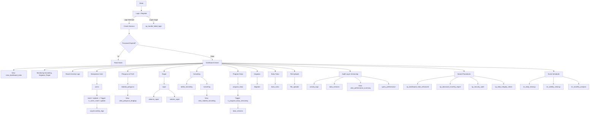

# KESIMPULAN DATABASE Syncergy (ENHANCED VERSION 3.0)

## Workflow


## 📁 **1. TABEL `users` (Pengguna Sistem)**

| Field                       | Tipe Data        | Keterangan                                                                 |
|-----------------------------|------------------|----------------------------------------------------------------------------|
| `user_id`                   | INT (PK, AI)     | ID unik pengguna                                                           |
| `name`                      | VARCHAR(100)     | Nama lengkap                                                               |
| `username`                  | VARCHAR(50)      | Username login (UNIQUE)                                                    |
| `password_hash`             | VARCHAR(255)     | Password yang di-hash (bcrypt/argon2)                                      |
| `role`                      | ENUM             | ('admin', 'pengurus', 'konselor', 'tamu')                                  |
| `email`                     | VARCHAR(100)     | Email (UNIQUE jika diisi)                                                  |
| `phone`                     | VARCHAR(20)      | Nomor telepon                                                              |
| `is_active`                 | BOOLEAN          | Status aktif user (default: TRUE)                                          |
| `password_expires_at`       | DATETIME         | Tanggal kedaluwarsa password                                               |
| `failed_login_attempts`     | INT              | Jumlah percobaan login gagal (default: 0)                                  |
| `locked_until`              | DATETIME         | Waktu akun terkunci hingga                                                 |
| `last_login_at`             | DATETIME         | Waktu login terakhir                                                       |
| `last_login_ip`             | VARCHAR(45)      | IP terakhir yang digunakan login                                           |
| `email_verified`            | BOOLEAN          | Status verifikasi email (default: FALSE)                                   |
| `email_verification_token`  | VARCHAR(255)     | Token untuk verifikasi email                                               |
| `password_reset_token`      | VARCHAR(255)     | Token untuk reset password                                                 |
| `password_reset_expires`    | DATETIME         | Waktu kedaluwarsa token reset password                                     |
| `created_at`                | DATETIME         | Waktu pembuatan data (default: CURRENT_TIMESTAMP)                          |
| `updated_at`                | DATETIME         | Waktu update terakhir (default: CURRENT_TIMESTAMP ON UPDATE)               |
| `deleted_at`                | DATETIME         | Soft delete timestamp                                                      |

---

## 📁 **2. TABEL `user_sessions` (Manajemen Sesi)**

| Field               | Tipe Data        | Keterangan                                                                 |
|---------------------|------------------|----------------------------------------------------------------------------|
| `id`                | VARCHAR(128) (PK)| ID sesi (session ID)                                                       |
| `user_id`           | INT              | ID pengguna (FK ke users)                                                  |
| `ip_address`        | VARCHAR(45)      | Alamat IP pengguna saat login                                              |
| `user_agent`        | TEXT             | User agent browser/perangkat                                               |
| `is_active`         | BOOLEAN          | Status sesi aktif (default: TRUE)                                          |
| `created_at`        | DATETIME         | Waktu pembuatan sesi (default: CURRENT_TIMESTAMP)                          |
| `last_activity_at`  | DATETIME         | Waktu aktivitas terakhir (default: CURRENT_TIMESTAMP ON UPDATE)            |
| `expires_at`        | DATETIME         | Waktu kedaluwarsa sesi                                                     |

---

## 📁 **3. TABEL `biodata_pengurus` (Biodata Pengurus)**

| Field             | Tipe Data        | Keterangan                                                                 |
|-------------------|------------------|----------------------------------------------------------------------------|
| `id`              | INT (PK, AI)     | ID unik biodata                                                            |
| `user_id`         | INT              | ID pengguna (FK ke users)                                                  |
| `tanggal_lahir`   | DATE             | Tanggal lahir                                                              |
| `nama_orang_tua`  | VARCHAR(100)     | Nama orang tua                                                             |
| `alamat`          | TEXT             | Alamat lengkap                                                             |
| `jabatan`         | VARCHAR(100)     | Jabatan dalam organisasi                                                   |
| `foto`            | TEXT             | Path/link foto                                                             |
| `keterangan`      | TEXT             | Keterangan tambahan                                                        |
| `created_at`      | DATETIME         | Waktu pembuatan data                                                       |
| `updated_at`      | DATETIME         | Waktu update terakhir                                                      |

---

## 📁 **4. TABEL `rapat` (Data Rapat)**

| Field             | Tipe Data        | Keterangan                                                                 |
|-------------------|------------------|----------------------------------------------------------------------------|
| `id`              | INT (PK, AI)     | ID unik rapat                                                              |
| `nama_rapat`      | VARCHAR(255)     | Nama/judul rapat                                                           |
| `isi`             | TEXT             | Deskripsi rapat                                                            |
| `tanggal_rapat`   | DATETIME         | Jadwal pelaksanaan rapat                                                   |
| `tempat`          | TEXT             | Lokasi rapat                                                               |
| `status`          | ENUM             | ('draft', 'terjadwal', 'berlangsung', 'selesai', 'batal')                  |
| `created_by`      | INT              | ID pembuat (FK ke users)                                                   |
| `max_peserta`     | INT              | Batas maksimal peserta (opsional)                                          |
| `reminder_sent`   | BOOLEAN          | Status pengiriman reminder (default: FALSE)                                |
| `created_at`      | DATETIME         | Waktu pembuatan data                                                       |
| `updated_at`      | DATETIME         | Waktu update terakhir                                                      |

---

## 📁 **5. TABEL `absensi_rapat` (Absensi Rapat)**

| Field         | Tipe Data        | Keterangan                                                                 |
|---------------|------------------|----------------------------------------------------------------------------|
| `id`          | INT (PK, AI)     | ID unik absensi                                                            |
| `rapat_id`    | INT              | ID rapat (FK ke rapat)                                                     |
| `user_id`     | INT              | ID pengguna (FK ke users)                                                  |
| `status`      | ENUM             | ('hadir', 'tidak_hadir', 'izin', 'terlambat') (default: 'tidak_hadir')     |
| `alamat`      | TEXT             | Alamat saat absen (jika berbeda)                                           |
| `ttd_path`    | TEXT             | Path tanda tangan digital                                                  |
| `waktu_absen` | DATETIME         | Waktu absen (default: CURRENT_TIMESTAMP)                                   |
| `catatan`     | TEXT             | Catatan tambahan                                                           |

---

## 📁 **6. TABEL `program_kerja` (Program Kerja)**

| Field                 | Tipe Data        | Keterangan                                                                 |
|-----------------------|------------------|----------------------------------------------------------------------------|
| `id`                  | INT (PK, AI)     | ID unik program                                                            |
| `nama_kegiatan`       | VARCHAR(255)     | Nama kegiatan                                                              |
| `tujuan`              | TEXT             | Tujuan kegiatan                                                            |
| `sasaran`             | TEXT             | Sasaran kegiatan                                                           |
| `mitra_kerja`         | TEXT             | Mitra kerja                                                                |
| `frekuensi`           | ENUM             | ('Harian', 'Mingguan', 'Bulanan', 'Tahunan')                               |
| `hasil_diharapkan`    | TEXT             | Hasil yang diharapkan                                                      |
| `status`              | ENUM             | ('draft', 'aktif', 'selesai', 'ditunda', 'dibatalkan') (default: 'draft')  |
| `tanggal_mulai`       | DATE             | Tanggal mulai kegiatan                                                     |
| `tanggal_selesai`     | DATE             | Tanggal selesai kegiatan                                                   |
| `progress_percentage` | DECIMAL(5,2)     | Persentase progres (0.00 - 100.00)                                         |
| `budget_allocated`    | DECIMAL(15,2)    | Anggaran yang dialokasikan                                                 |
| `budget_used`         | DECIMAL(15,2)    | Anggaran yang digunakan                                                    |
| `pic_id`              | INT              | Penanggung jawab (FK ke users)                                             |
| `keterangan`          | TEXT             | Keterangan tambahan                                                        |
| `created_at`          | DATETIME         | Waktu pembuatan data                                                       |
| `updated_at`          | DATETIME         | Waktu update terakhir                                                      |

---

## 📁 **7. TABEL `daftar_hadir_acara` (Daftar Hadir Acara Umum)**

| Field         | Tipe Data        | Keterangan                                                                 |
|---------------|------------------|----------------------------------------------------------------------------|
| `id`          | INT (PK, AI)     | ID unik kehadiran                                                          |
| `tanggal`     | DATE             | Tanggal acara                                                              |
| `nama_acara`  | VARCHAR(255)     | Nama acara                                                                 |
| `user_id`     | INT              | ID peserta (FK ke users)                                                   |
| `status`      | ENUM             | ('hadir', 'tidak_hadir', 'izin') (default: 'tidak_hadir')                  |
| `alamat`      | TEXT             | Alamat saat hadir                                                          |
| `ttd_path`    | TEXT             | Path tanda tangan digital                                                  |
| `waktu_hadir` | DATETIME         | Waktu kehadiran                                                            |
| `catatan`     | TEXT             | Catatan tambahan                                                           |

---

## 📁 **8. TABEL `notulen_rapat` (Notulen Rapat)**

| Field               | Tipe Data        | Keterangan                                                                 |
|---------------------|------------------|----------------------------------------------------------------------------|
| `id`                | INT (PK, AI)     | ID unik notulen                                                            |
| `rapat_id`          | INT              | ID rapat (FK ke rapat)                                                     |
| `tanggal`           | DATE             | Tanggal rapat                                                              |
| `waktu`             | TIME             | Waktu mulai rapat                                                          |
| `tempat`            | TEXT             | Tempat rapat                                                               |
| `jumlah_peserta`    | INT              | Jumlah peserta hadir                                                       |
| `materi`            | TEXT             | Materi rapat                                                               |
| `isi_notulen`       | TEXT             | Isi lengkap notulen                                                        |
| `keterangan`        | TEXT             | Keterangan tambahan                                                        |
| `notulis_id`        | INT              | ID notulis (FK ke users)                                                   |
| `status`            | ENUM             | ('draft', 'review', 'approved', 'published') (default: 'draft')            |
| `approved_by`       | INT              | ID yang menyetujui (FK ke users)                                           |
| `approved_at`       | DATETIME         | Waktu persetujuan                                                          |
| `created_at`        | DATETIME         | Waktu pembuatan data                                                       |
| `updated_at`        | DATETIME         | Waktu update terakhir                                                      |

---

## 📁 **9. TABEL `kegiatan` (Kegiatan Dilaksanakan)**

| Field                 | Tipe Data        | Keterangan                                                                 |
|-----------------------|------------------|----------------------------------------------------------------------------|
| `id`                  | INT (PK, AI)     | ID unik kegiatan                                                           |
| `tanggal`             | DATE             | Tanggal kegiatan                                                           |
| `nama_kegiatan`       | VARCHAR(255)     | Nama kegiatan                                                              |
| `sasaran`             | TEXT             | Sasaran kegiatan                                                           |
| `lokasi`              | TEXT             | Lokasi kegiatan                                                            |
| `hasil_dicapai`       | TEXT             | Hasil yang dicapai                                                         |
| `status`              | ENUM             | ('direncanakan', 'berlangsung', 'selesai', 'batal') (default: 'direncanakan') |
| `penanggung_jawab_id` | INT              | ID penanggung jawab (FK ke users)                                          |
| `jumlah_peserta`      | INT              | Jumlah peserta (default: 0)                                                |
| `budget`              | DECIMAL(15,2)    | Anggaran yang digunakan                                                    |
| `evaluasi`            | TEXT             | Evaluasi kegiatan                                                          |
| `foto_kegiatan`       | JSON             | Daftar path foto kegiatan (array)                                          |
| `keterangan`          | TEXT             | Keterangan tambahan                                                        |
| `created_at`          | DATETIME         | Waktu pembuatan data                                                       |
| `updated_at`          | DATETIME         | Waktu update terakhir                                                      |

---

## 📁 **10. TABEL `buku_tamu` (Buku Tamu)**

| Field               | Tipe Data        | Keterangan                                                                 |
|---------------------|------------------|----------------------------------------------------------------------------|
| `id`                | INT (PK, AI)     | ID unik tamu                                                               |
| `tanggal`           | DATE             | Tanggal kunjungan                                                          |
| `nama`              | VARCHAR(100)     | Nama tamu                                                                  |
| `jabatan`           | VARCHAR(100)     | Jabatan tamu                                                               |
| `instansi`          | VARCHAR(255)     | Asal instansi                                                              |
| `email`             | VARCHAR(100)     | Email tamu                                                                 |
| `telepon`           | VARCHAR(20)      | Nomor telepon tamu                                                         |
| `tujuan`            | TEXT             | Tujuan kunjungan                                                           |
| `ttd_path`          | TEXT             | Path tanda tangan digital                                                  |
| `waktu_kunjungan`   | TIME             | Waktu mulai kunjungan                                                      |
| `waktu_selesai`     | TIME             | Waktu selesai kunjungan                                                    |
| `status`            | ENUM             | ('menunggu', 'dilayani', 'selesai') (default: 'menunggu')                  |
| `dilayani_oleh`     | INT              | ID petugas yang melayani (FK ke users)                                     |
| `created_at`        | DATETIME         | Waktu pembuatan data (default: CURRENT_TIMESTAMP)                          |

---

## 📁 **11. TABEL `konseling` (Sesi Konseling)**

| Field                 | Tipe Data        | Keterangan                                                                 |
|-----------------------|------------------|----------------------------------------------------------------------------|
| `id`                  | INT (PK, AI)     | ID unik sesi konseling                                                     |
| `tanggal`             | DATE             | Tanggal konseling                                                          |
| `waktu_mulai`         | TIME             | Waktu mulai konseling                                                      |
| `waktu_selesai`       | TIME             | Waktu selesai konseling                                                    |
| `tema`                | TEXT             | Tema konseling                                                             |
| `konselor_id`         | INT              | ID konselor (FK ke users)                                                  |
| `peserta_id`          | INT              | ID peserta (FK ke users) - untuk individual                                |
| `jenis`               | ENUM             | ('individual', 'kelompok', 'online', 'offline') (default: 'individual')    |
| `status`              | ENUM             | ('terjadwal', 'berlangsung', 'selesai', 'batal') (default: 'terjadwal')    |
| `metode`              | ENUM             | ('tatap_muka', 'video_call', 'telepon', 'chat') (default: 'tatap_muka')    |
| `lokasi`              | TEXT             | Tempat/link konseling                                                      |
| `jumlah_peserta`      | INT              | Jumlah peserta (default: 1)                                                |
| `catatan`             | TEXT             | Catatan konseling                                                          |
| `follow_up_required`  | BOOLEAN          | Perlu tindak lanjut? (default: FALSE)                                      |
| `follow_up_date`      | DATE             | Tanggal follow-up jika diperlukan                                          |
| `rating`              | INT              | Rating kepuasan                                                            |
| `feedback`            | TEXT             | Umpan balik peserta                                                        |
| `created_at`          | DATETIME         | Waktu pembuatan data                                                       |
| `updated_at`          | DATETIME         | Waktu update terakhir                                                      |

---

## 📁 **12. TABEL `daftar_konseling` (Pendaftaran Konseling)**

| Field                 | Tipe Data        | Keterangan                                                                 |
|-----------------------|------------------|----------------------------------------------------------------------------|
| `id`                  | INT (PK, AI)     | ID unik pendaftaran                                                        |
| `tanggal_daftar`      | DATE             | Tanggal pendaftaran                                                        |
| `tanggal_konseling`   | DATE             | Tanggal konseling yang diinginkan                                          |
| `waktu_konseling`     | TIME             | Waktu konseling yang diinginkan                                            |
| `konselor_id`         | INT              | ID konselor yang dituju (FK ke users)                                      |
| `pendaftar_id`        | INT              | ID pendaftar (FK ke users) - jika sudah punya akun                         |
| `nama_pendaftar`      | VARCHAR(100)     | Nama pendaftar (jika tidak punya akun)                                     |
| `kontak_pendaftar`    | VARCHAR(100)     | Kontak pendaftar (email/telp)                                              |
| `jenis_konseling`     | ENUM             | ('online', 'offline')                                                      |
| `topik_konseling`     | TEXT             | Topik yang ingin dikonsultasikan                                           |
| `lokasi`              | TEXT             | Lokasi yang diinginkan                                                     |
| `status`              | ENUM             | ('pending', 'disetujui', 'ditolak', 'selesai', 'batal') (default: 'pending')|
| `prioritas`           | ENUM             | ('rendah', 'normal', 'tinggi', 'urgent') (default: 'normal')               |
| `alasan_penolakan`    | TEXT             | Alasan jika ditolak                                                        |
| `keterangan`          | TEXT             | Keterangan tambahan                                                        |
| `created_at`          | DATETIME         | Waktu pembuatan data                                                       |
| `updated_at`          | DATETIME         | Waktu update terakhir                                                      |

---

## 📁 **13. TABEL `file_uploads` (Upload File)**

| Field                   | Tipe Data        | Keterangan                                                                 |
|-------------------------|------------------|----------------------------------------------------------------------------|
| `id`                    | INT (PK, AI)     | ID unik file                                                               |
| `filename`              | VARCHAR(255)     | Nama file di sistem                                                        |
| `original_name`         | VARCHAR(255)     | Nama asli file                                                             |
| `file_path`             | TEXT             | Path file                                                                  |
| `file_size`             | INT              | Ukuran file (byte)                                                         |
| `mime_type`             | VARCHAR(100)     | Tipe MIME file                                                             |
| `category`              | ENUM             | ('document', 'image', 'video', 'audio', 'other') (default: 'document')     |
| `uploaded_by`           | INT              | ID pengunggah (FK ke users)                                                |
| `is_public`             | BOOLEAN          | Apakah file publik? (default: FALSE)                                       |
| `download_count`        | INT              | Jumlah download (default: 0)                                               |
| `virus_scan_status`     | ENUM             | ('pending', 'clean', 'infected', 'error') (default: 'pending')             |
| `uploaded_at`           | DATETIME         | Waktu upload (default: CURRENT_TIMESTAMP)                                  |

---

## 📁 **14. TABEL `activity_logs` (Log Aktivitas - Enhanced)**

| Field           | Tipe Data        | Keterangan                                                                 |
|-----------------|------------------|----------------------------------------------------------------------------|
| `id`            | INT (PK, AI)     | ID unik log                                                                |
| `user_id`       | INT              | ID pengguna terkait (FK ke users)                                          |
| `session_id`    | VARCHAR(128)     | ID sesi terkait (FK ke user_sessions)                                      |
| `action`        | VARCHAR(100)     | Aksi yang dilakukan (e.g., INSERT, UPDATE, LOGIN)                          |
| `table_name`    | VARCHAR(50)      | Nama tabel terkait                                                         |
| `record_id`     | INT              | ID record yang dimodifikasi                                                |
| `old_values`    | JSON             | Nilai lama (dalam JSON)                                                    |
| `new_values`    | JSON             | Nilai baru (dalam JSON)                                                    |
| `description`   | TEXT             | Deskripsi aktivitas                                                        |
| `severity`      | ENUM             | ('low', 'medium', 'high', 'critical') (default: 'low')                     |
| `ip_address`    | VARCHAR(45)      | Alamat IP                                                                  |
| `user_agent`    | TEXT             | User agent browser/perangkat                                               |
| `created_at`    | DATETIME         | Waktu log (default: CURRENT_TIMESTAMP)                                     |

*Tabel ini dipartisi berdasarkan tahun `created_at`*

---

## 📁 **15. TABEL `data_versions` (Versi Data)**

| Field             | Tipe Data        | Keterangan                                                                 |
|-------------------|------------------|----------------------------------------------------------------------------|
| `id`              | INT (PK, AI)     | ID unik versi                                                              |
| `table_name`      | VARCHAR(50)      | Nama tabel asal data                                                       |
| `record_id`       | INT              | ID record asal                                                             |
| `version_number`  | INT              | Nomor versi (dimulai dari 1)                                               |
| `version_data`    | JSON             | Data versi (dalam JSON)                                                    |
| `created_at`      | DATETIME         | Waktu pembuatan versi (default: CURRENT_TIMESTAMP)                         |
| `created_by`      | INT              | ID pembuat versi (FK ke users)                                             |
| `comment`         | TEXT             | Komentar perubahan                                                         |

---

## 📁 **16. TABEL `query_performance` (Kinerja Query)**

| Field             | Tipe Data        | Keterangan                                                                 |
|-------------------|------------------|----------------------------------------------------------------------------|
| `id`              | INT (PK, AI)     | ID unik log query                                                          |
| `query_hash`      | VARCHAR(64)      | Hash dari query                                                            |
| `query_type`      | ENUM             | ('SELECT', 'INSERT', 'UPDATE', 'DELETE', 'OTHER')                          |
| `execution_time`  | DECIMAL(10,6)    | Waktu eksekusi (dalam detik)                                               |
| `rows_affected`   | INT              | Jumlah baris yang terpengaruh                                              |
| `database_name`   | VARCHAR(64)      | Nama database                                                              |
| `table_names`     | TEXT             | Nama tabel yang terlibat                                                   |
| `user_id`         | INT              | ID pengguna (jika ada) (FK ke users)                                       |
| `created_at`      | DATETIME         | Waktu log (default: CURRENT_TIMESTAMP)                                     |

---

## 🧠 FITUR TAMBAHAN

1. **View Dashboard Statistik**: view_dashboard_stats, view_pengurus_lengkap, view_statistik_konseling, view_performance_summary.
2. **Trigger Audit & Versioning**: tr_users_insert, tr_users_update, tr_users_password_policy, tr_program_kerja_versioning, tr_session_cleanup.
3. **Stored Procedures**: sp_dashboard_stats_enhanced, sp_handle_failed_login, sp_handle_successful_login, sp_comprehensive_cleanup, sp_advanced_monthly_report, sp_security_audit, sp_performance_optimization, sp_data_integrity_check.
4. **Indeks Lanjutan**: Indeks komposit, full-text search (InnoDB/MyISAM), covering index.
5. **Event Terjadwal**: ev_daily_cleanup (harian, single statement), ev_weekly_cleanup (mingguan, call procedure), ev_monthly_analysis (bulanan, multi-statement pakai DELIMITER).
6. **Konfigurasi Keamanan Pengguna Database**: pikr_app, pikr_backup, pikr_analytics (lihat bagian komentar di database.sql).

---

## 🚀 CARA MENGGUNAKAN

1. **Persiapan**:
   - Install MySQL/MariaDB versi terbaru.
   - Buat database baru: `CREATE DATABASE syncergy;`
   - Aktifkan event scheduler: `SET GLOBAL event_scheduler = ON;`

2. **Eksekusi Skrip**:
   ```bash
   mysql -u [username] -p syncergy < database.sql
   ```

3. **Konfigurasi Keamanan**:
   - Jalankan perintah GRANT user database secara manual (lihat bagian komentar di database.sql).

4. **Integrasi Aplikasi**:
   - Gunakan user `pikr_app` untuk koneksi aplikasi.
   - Pastikan aplikasi menangani session management sesuai tabel `user_sessions`.

5. **Pemeliharaan Rutin**:
   - Pantau event scheduler: `SHOW EVENTS;`
   - Jalankan prosedur manual jika perlu:
     ```sql
     CALL sp_comprehensive_cleanup();
     CALL sp_security_audit();
     ```

6. **Testing**:
   ```sql
   SELECT * FROM view_dashboard_stats;
   CALL sp_dashboard_stats_enhanced();
   ```

7. **Optimisasi**:
   - Pantau slow query: `SELECT * FROM query_performance ORDER BY execution_time DESC LIMIT 10;`
   - Gunakan `EXPLAIN` untuk query kompleks.

**Catatan Penting**:
- Backup database minimal 1x/hari.
- Lakukan `OPTIMIZE TABLE` bulanan untuk tabel besar.
- Event scheduler harian hanya menghapus session expired, pembersihan lain via event mingguan/bulanan.
- Warning FULLTEXT index pada InnoDB (FTS_DOC_ID) adalah normal dan bisa diabaikan.
   - Aplikasi backend harus menggunakan kredensial user `pikr_app` (atau sesuai) untuk mengakses database.
   - Pastikan aplikasi menangani session management dengan baik (sesuai tabel `user_sessions`).

5. **Pemeliharaan Rutin**:
   - Event terjadwal akan berjalan otomatis untuk pembersihan dan analisis.
   - Gunakan prosedur `sp_security_audit` dan `sp_data_integrity_check` secara berkala.
   - Pantau tabel `query_performance` untuk optimisasi.

### 🛠️ TESTING:

- Gunakan query testing yang disediakan di bagian akhir file untuk memastikan semua fitur berjalan.
- Contoh:
  ```sql
  CALL sp_dashboard_stats_enhanced();
  CALL sp_advanced_monthly_report(2025, 6);
  SELECT * FROM view_dashboard_stats;
  ```

### 📝 DOKUMENTASI:

- File ini sudah dilengkapi dokumentasi internal yang lengkap di dalam komentar.
- Dokumentasi mencakup:
  - Penjelasan tabel, view, trigger, stored procedure.
  - Panduan deployment dan maintenance.
  - Contoh query dan penggunaan.

### ⚠️ PENTING:

- **BACKUP** database secara rutin.
- Lakukan **PENGETESAN** menyeluruh sebelum deploy ke produksi.
- Sesuaikan konfigurasi (seperti path file) sesuai lingkungan server.
```

### Cara Menggunakan Database:
1. **Persiapan**:
   - Install MySQL/MariaDB versi terbaru
   - Buat database baru: `CREATE DATABASE syncergy;`

2. **Eksekusi Skrip**:
   ```bash
   mysql -u [username] -p syncergy < database.sql
   ```
   Masukkan password saat diminta

3. **Konfigurasi Keamanan**:
   - Buka bagian komentar di akhir skrip (mulai dari `/*`)
   - Jalankan perintah `GRANT` secara manual untuk user database

4. **Integrasi Aplikasi**:
   ```javascript
   // Contoh koneksi Node.js
   const mysql = require('mysql2');
   const pool = mysql.createPool({
     host: 'localhost',
     user: 'pikr_app',
     password: 'YourStrongPasswordHere2025!',
     database: 'syncergy'
   });
   ```

5. **Pemeliharaan Rutin**:
   - Pantau event scheduler: `SHOW EVENTS;`
   - Jalankan prosedur manual:
     ```sql
     CALL sp_comprehensive_cleanup();
     CALL sp_security_audit();
     ```

6. **Testing**:
   ```sql
   -- Cek statistik dashboard
   SELECT * FROM view_dashboard_stats;
   
   -- Cari kegiatan dengan fulltext search
   SELECT * FROM kegiatan 
   WHERE MATCH(nama_kegiatan, sasaran) AGAINST('remaja sekolah');
   ```

7. **Optimisasi**:
   - Pantau slow query: `SELECT * FROM query_performance ORDER BY execution_time DESC LIMIT 10;`
   - Gunakan `EXPLAIN` untuk query kompleks

**Catatan Penting**:
- Backup database minimal 1x/hari
- Lakukan `OPTIMIZE TABLE` bulanan untuk tabel besar
- Monitor partisi tabel `activity_logs` setiap tahun
