# KESIMPULAN DATABASE Syncergy (ENHANCED VERSION 3.0)

## Workflow

```mermaid
flowchart TD

%% === USER AUTHENTICATION & SESSION ===
A1[Mulai] --> A2[Login / Register]
A2 -->|Login Berhasil| A3["Create Session (user_sessions)"]
A2 -->|Login Gagal| A4[sp_handle_failed_login]
A3 --> A5{Password Expired?}
A5 -- Ya --> A6[Tolak Akses]
A5 -- Tidak --> A7[Dashboard Utama]

%% === DASHBOARD & MONITORING ===
A7 --> B1[View: view_dashboard_stats]
A7 --> B2[Monitoring Konseling, Kegiatan, Rapat]
A7 --> B3[Recent Activity Logs]

%% === MODUL USER & AUDIT ===
A7 --> C1[Manajemen User]
C1 --> C2[users]
C2 --> C3[Insert/Update -> Trigger: tr_users_insert/update]
C3 --> C4[Log ke activity_logs]

%% === MODUL PENGURUS ===
A7 --> D1[Pengurus & Profil]
D1 --> D2[biodata_pengurus]
D2 --> D3[View: view_pengurus_lengkap]

%% === MODUL RAPAT ===
A7 --> E1[Rapat]
E1 --> E2[rapat]
E2 --> E3[absensi_rapat]
E2 --> E4[notulen_rapat]

%% === MODUL KONSELING ===
A7 --> F1[Konseling]
F1 --> F2[daftar_konseling]
F1 --> F3[konseling]
F3 --> F4[View: view_statistik_konseling]

%% === MODUL PROGRAM & KEGIATAN ===
A7 --> G1[Program Kerja]
G1 --> G2[program_kerja]
G2 --> G3[Trigger: tr_program_kerja_versioning]
G3 --> G4[data_versions]

A7 --> G5[Kegiatan]
G5 --> G6[kegiatan]

%% === MODUL TAMU & FILE ===
A7 --> H1[Buku Tamu]
H1 --> H2[buku_tamu]
A7 --> H3[File Uploads]
H3 --> H4[file_uploads]

%% === AUDIT & MONITORING ===
A7 --> I1[Audit Log & Versioning]
I1 --> I2[activity_logs]
I1 --> I3[data_versions]
I1 --> I4[View: view_performance_summary]
I1 --> I5[query_performance]

%% === STORED PROCEDURE & EVENTS ===
A7 --> J1[Stored Procedures]
J1 --> J2[sp_dashboard_stats_enhanced]
J1 --> J3[sp_advanced_monthly_report]
J1 --> J4[sp_security_audit]
J1 --> J5[sp_data_integrity_check]
J1 --> J6[sp_handle_failed_login]
J1 --> J7[sp_handle_successful_login]
J1 --> J8[sp_comprehensive_cleanup]
J1 --> J9[sp_performance_optimization]

A7 --> K1[Event Scheduler]
K1 --> K2[ev_daily_cleanup]
K1 --> K3[ev_weekly_cleanup]
K1 --> K4[ev_monthly_analysis]
```


---

## 📁 TABEL UTAMA

### 1. `users`
| Field | Tipe Data | Keterangan |
|-------|-----------|------------|
| user_id | INT (PK, AI) | ID unik pengguna |
| name | VARCHAR(100) | Nama lengkap |
| username | VARCHAR(50) | Username login (UNIQUE) |
| password_hash | VARCHAR(255) | Password di-hash (bcrypt) |
| role | ENUM('admin','pengurus','konselor','tamu') | Peran pengguna |
| email | VARCHAR(100) | Email (UNIQUE jika diisi) |
| phone | VARCHAR(20) | Nomor telepon |
| is_active | BOOLEAN | Status aktif (default: TRUE) |
| password_expires_at | DATETIME | Tanggal kadaluarsa password |
| failed_login_attempts | INT | Jumlah login gagal |
| locked_until | DATETIME | Waktu akun terkunci hingga |
| last_login_at | DATETIME | Waktu login terakhir |
| last_login_ip | VARCHAR(45) | IP terakhir login |
| email_verified | BOOLEAN | Status verifikasi email |
| email_verification_token | VARCHAR(255) | Token verifikasi email |
| password_reset_token | VARCHAR(255) | Token reset password |
| password_reset_expires | DATETIME | Expired token reset |
| created_at | DATETIME | Waktu pembuatan |
| updated_at | DATETIME | Waktu update terakhir |
| deleted_at | DATETIME | Soft delete timestamp |

### 2. `user_sessions`
| Field | Tipe Data | Keterangan |
|-------|-----------|------------|
| id | VARCHAR(128) (PK) | Session ID |
| user_id | INT | FK ke users |
| ip_address | VARCHAR(45) | IP login |
| user_agent | TEXT | User agent |
| is_active | BOOLEAN | Status sesi aktif |
| created_at | DATETIME | Waktu pembuatan |
| last_activity_at | DATETIME | Waktu aktivitas terakhir |
| expires_at | DATETIME | Expired session |

### 3. `biodata_pengurus`
| Field | Tipe Data | Keterangan |
|-------|-----------|------------|
| id | INT (PK, AI) | ID unik biodata |
| user_id | INT | FK ke users |
| tanggal_lahir | DATE | Tanggal lahir |
| nama_orang_tua | VARCHAR(100) | Nama orang tua |
| alamat | TEXT | Alamat |
| jabatan | VARCHAR(100) | Jabatan organisasi |
| foto | TEXT | Path/link foto |
| keterangan | TEXT | Keterangan tambahan |
| created_at | DATETIME | Waktu pembuatan |
| updated_at | DATETIME | Waktu update terakhir |

### 4. `rapat`
| Field | Tipe Data | Keterangan |
|-------|-----------|------------|
| id | INT (PK, AI) | ID unik rapat |
| nama_rapat | VARCHAR(255) | Nama/judul rapat |
| isi | TEXT | Deskripsi rapat |
| tanggal_rapat | DATETIME | Jadwal rapat |
| tempat | TEXT | Lokasi rapat |
| status | ENUM('draft','terjadwal','berlangsung','selesai','batal') | Status rapat |
| created_by | INT | FK ke users |
| max_peserta | INT | Maksimal peserta |
| reminder_sent | BOOLEAN | Status reminder |
| created_at | DATETIME | Waktu pembuatan |
| updated_at | DATETIME | Waktu update terakhir |

### 5. `absensi_rapat`
| Field | Tipe Data | Keterangan |
|-------|-----------|------------|
| id | INT (PK, AI) | ID unik absensi |
| rapat_id | INT | FK ke rapat |
| user_id | INT | FK ke users |
| status | ENUM('hadir','tidak_hadir','izin','terlambat') | Status absen |
| alamat | TEXT | Alamat saat absen |
| ttd_path | TEXT | Path tanda tangan |
| waktu_absen | DATETIME | Waktu absen |
| catatan | TEXT | Catatan tambahan |

### 6. `program_kerja`
| Field | Tipe Data | Keterangan |
|-------|-----------|------------|
| id | INT (PK, AI) | ID unik program |
| nama_kegiatan | VARCHAR(255) | Nama kegiatan |
| tujuan | TEXT | Tujuan kegiatan |
| sasaran | TEXT | Sasaran kegiatan |
| mitra_kerja | TEXT | Mitra kerja |
| frekuensi | ENUM('Harian','Mingguan','Bulanan','Tahunan') | Frekuensi |
| hasil_diharapkan | TEXT | Hasil diharapkan |
| status | ENUM('draft','aktif','selesai','ditunda','dibatalkan') | Status |
| tanggal_mulai | DATE | Tanggal mulai |
| tanggal_selesai | DATE | Tanggal selesai |
| progress_percentage | DECIMAL(5,2) | Persentase progres |
| budget_allocated | DECIMAL(15,2) | Anggaran dialokasikan |
| budget_used | DECIMAL(15,2) | Anggaran digunakan |
| pic_id | INT | Penanggung jawab (FK ke users) |
| keterangan | TEXT | Keterangan tambahan |
| created_at | DATETIME | Waktu pembuatan |
| updated_at | DATETIME | Waktu update terakhir |

### 7. `daftar_hadir_acara`
| Field | Tipe Data | Keterangan |
|-------|-----------|------------|
| id | INT (PK, AI) | ID unik kehadiran |
| tanggal | DATE | Tanggal acara |
| nama_acara | VARCHAR(255) | Nama acara |
| user_id | INT | FK ke users |
| status | ENUM('hadir','tidak_hadir','izin') | Status hadir |
| alamat | TEXT | Alamat saat hadir |
| ttd_path | TEXT | Path tanda tangan |
| waktu_hadir | DATETIME | Waktu hadir |
| catatan | TEXT | Catatan tambahan |

### 8. `notulen_rapat`
| Field | Tipe Data | Keterangan |
|-------|-----------|------------|
| id | INT (PK, AI) | ID unik notulen |
| rapat_id | INT | FK ke rapat |
| tanggal | DATE | Tanggal rapat |
| waktu | TIME | Waktu mulai |
| tempat | TEXT | Tempat rapat |
| jumlah_peserta | INT | Jumlah peserta |
| materi | TEXT | Materi rapat |
| isi_notulen | TEXT | Isi notulen |
| keterangan | TEXT | Keterangan tambahan |
| notulis_id | INT | FK ke users |
| status | ENUM('draft','review','approved','published') | Status notulen |
| approved_by | INT | FK ke users |
| approved_at | DATETIME | Waktu persetujuan |
| created_at | DATETIME | Waktu pembuatan |
| updated_at | DATETIME | Waktu update terakhir |

### 9. `kegiatan`
| Field | Tipe Data | Keterangan |
|-------|-----------|------------|
| id | INT (PK, AI) | ID unik kegiatan |
| tanggal | DATE | Tanggal kegiatan |
| nama_kegiatan | VARCHAR(255) | Nama kegiatan |
| sasaran | TEXT | Sasaran kegiatan |
| lokasi | TEXT | Lokasi kegiatan |
| hasil_dicapai | TEXT | Hasil dicapai |
| status | ENUM('direncanakan','berlangsung','selesai','batal') | Status kegiatan |
| penanggung_jawab_id | INT | FK ke users |
| jumlah_peserta | INT | Jumlah peserta |
| budget | DECIMAL(15,2) | Anggaran digunakan |
| evaluasi | TEXT | Evaluasi kegiatan |
| foto_kegiatan | JSON | Daftar path foto |
| keterangan | TEXT | Keterangan tambahan |
| created_at | DATETIME | Waktu pembuatan |
| updated_at | DATETIME | Waktu update terakhir |

### 10. `buku_tamu`
| Field | Tipe Data | Keterangan |
|-------|-----------|------------|
| id | INT (PK, AI) | ID unik tamu |
| tanggal | DATE | Tanggal kunjungan |
| nama | VARCHAR(100) | Nama tamu |
| jabatan | VARCHAR(100) | Jabatan tamu |
| instansi | VARCHAR(255) | Asal instansi |
| email | VARCHAR(100) | Email tamu |
| telepon | VARCHAR(20) | Nomor telepon tamu |
| tujuan | TEXT | Tujuan kunjungan |
| ttd_path | TEXT | Path tanda tangan |
| waktu_kunjungan | TIME | Waktu mulai kunjungan |
| waktu_selesai | TIME | Waktu selesai kunjungan |
| status | ENUM('menunggu','dilayani','selesai') | Status kunjungan |
| dilayani_oleh | INT | FK ke users |
| created_at | DATETIME | Waktu pembuatan |

### 11. `konseling`
| Field | Tipe Data | Keterangan |
|-------|-----------|------------|
| id | INT (PK, AI) | ID unik sesi konseling |
| tanggal | DATE | Tanggal konseling |
| waktu_mulai | TIME | Waktu mulai |
| waktu_selesai | TIME | Waktu selesai |
| tema | TEXT | Tema konseling |
| konselor_id | INT | FK ke users |
| peserta_id | INT | FK ke users (optional) |
| jenis | ENUM('individual','kelompok','online','offline') | Jenis konseling |
| status | ENUM('terjadwal','berlangsung','selesai','batal') | Status |
| metode | ENUM('tatap_muka','video_call','telepon','chat') | Metode |
| lokasi | TEXT | Tempat/link konseling |
| jumlah_peserta | INT | Jumlah peserta |
| catatan | TEXT | Catatan konseling |
| follow_up_required | BOOLEAN | Perlu tindak lanjut? |
| follow_up_date | DATE | Tanggal follow-up |
| rating | INT | Rating kepuasan |
| feedback | TEXT | Umpan balik peserta |
| created_at | DATETIME | Waktu pembuatan |
| updated_at | DATETIME | Waktu update terakhir |

### 12. `daftar_konseling`
| Field | Tipe Data | Keterangan |
|-------|-----------|------------|
| id | INT (PK, AI) | ID unik pendaftaran |
| tanggal_daftar | DATE | Tanggal daftar |
| tanggal_konseling | DATE | Tanggal konseling diinginkan |
| waktu_konseling | TIME | Waktu konseling diinginkan |
| konselor_id | INT | FK ke users |
| pendaftar_id | INT | FK ke users (optional) |
| nama_pendaftar | VARCHAR(100) | Nama pendaftar |
| kontak_pendaftar | VARCHAR(100) | Kontak pendaftar |
| jenis_konseling | ENUM('online','offline') | Jenis konseling |
| topik_konseling | TEXT | Topik konsultasi |
| lokasi | TEXT | Lokasi diinginkan |
| status | ENUM('pending','disetujui','ditolak','selesai','batal') | Status |
| prioritas | ENUM('rendah','normal','tinggi','urgent') | Prioritas |
| alasan_penolakan | TEXT | Alasan penolakan |
| keterangan | TEXT | Keterangan tambahan |
| created_at | DATETIME | Waktu pembuatan |
| updated_at | DATETIME | Waktu update terakhir |

### 13. `file_uploads`
| Field | Tipe Data | Keterangan |
|-------|-----------|------------|
| id | INT (PK, AI) | ID unik file |
| filename | VARCHAR(255) | Nama file di sistem |
| original_name | VARCHAR(255) | Nama asli file |
| file_path | TEXT | Path file |
| file_size | INT | Ukuran file (byte) |
| mime_type | VARCHAR(100) | Tipe MIME file |
| category | ENUM('document','image','video','audio','other') | Kategori file |
| uploaded_by | INT | FK ke users |
| is_public | BOOLEAN | Status publik |
| download_count | INT | Jumlah download |
| virus_scan_status | ENUM('pending','clean','infected','error') | Status scan virus |
| uploaded_at | DATETIME | Waktu upload |

### 14. `activity_logs`
| Field | Tipe Data | Keterangan |
|-------|-----------|------------|
| id | INT (PK, AI) | ID unik log |
| user_id | INT | FK ke users |
| session_id | VARCHAR(128) | FK ke user_sessions |
| action | VARCHAR(100) | Aksi (INSERT, UPDATE, LOGIN, dll) |
| table_name | VARCHAR(50) | Nama tabel terkait |
| record_id | INT | ID record dimodifikasi |
| old_values | JSON | Nilai lama |
| new_values | JSON | Nilai baru |
| description | TEXT | Deskripsi aktivitas |
| severity | ENUM('low','medium','high','critical') | Level severity |
| ip_address | VARCHAR(45) | IP address |
| user_agent | TEXT | User agent |
| created_at | DATETIME | Waktu log |

### 15. `data_versions`
| Field | Tipe Data | Keterangan |
|-------|-----------|------------|
| id | INT (PK, AI) | ID unik versi |
| table_name | VARCHAR(50) | Nama tabel asal |
| record_id | INT | ID record asal |
| version_number | INT | Nomor versi |
| version_data | JSON | Data versi |
| created_at | DATETIME | Waktu versi dibuat |
| created_by | INT | FK ke users |
| comment | TEXT | Komentar perubahan |

### 16. `query_performance`
| Field | Tipe Data | Keterangan |
|-------|-----------|------------|
| id | INT (PK, AI) | ID unik log query |
| query_hash | VARCHAR(64) | Hash query |
| query_type | ENUM('SELECT','INSERT','UPDATE','DELETE','OTHER') | Tipe query |
| execution_time | DECIMAL(10,6) | Waktu eksekusi (detik) |
| rows_affected | INT | Jumlah baris terpengaruh |
| database_name | VARCHAR(64) | Nama database |
| table_names | TEXT | Nama tabel terlibat |
| user_id | INT | FK ke users |
| created_at | DATETIME | Waktu log |

---

## 🧠 FITUR TAMBAHAN

- **Views:** view_dashboard_stats, view_pengurus_lengkap, view_statistik_konseling, view_performance_summary.
- **Triggers:** tr_users_insert, tr_users_update, tr_users_password_policy, tr_program_kerja_versioning.
- **Stored Procedures:** sp_dashboard_stats_enhanced, sp_handle_failed_login, sp_handle_successful_login, sp_comprehensive_cleanup, sp_advanced_monthly_report, sp_security_audit, sp_performance_optimization, sp_data_integrity_check.
- **Indeks:** Komposit, full-text search, covering index.
- **Events:** ev_daily_cleanup, ev_weekly_cleanup, ev_monthly_analysis.
- **Security Users:** pikr_app, pikr_backup, pikr_analytics (lihat bagian komentar di database.sql).

---

## 🚀 CARA MENGGUNAKAN

1. **Persiapan:**
   - Install MySQL/MariaDB terbaru.
   - Buat database: `CREATE DATABASE Syncergy;`
   - Aktifkan event scheduler: `SET GLOBAL event_scheduler = ON;`

2. **Eksekusi Skrip:**
   ```bash
   mysql -u [username] -p Syncergy < database.sql
   ```

3. **Konfigurasi Keamanan:**
   - Jalankan perintah GRANT user database secara manual (lihat komentar di database.sql).

4. **Integrasi Aplikasi:**
   - Gunakan user `pikr_app` untuk koneksi aplikasi.
   - Pastikan aplikasi menangani session management sesuai tabel `user_sessions`.

5. **Pemeliharaan Rutin:**
   - Pantau event scheduler: `SHOW EVENTS;`
   - Jalankan prosedur manual jika perlu:
     ```sql
     CALL sp_comprehensive_cleanup();
     CALL sp_security_audit();
     ```

6. **Testing:**
   ```sql
   SELECT * FROM view_dashboard_stats;
   CALL sp_dashboard_stats_enhanced();
   ```

7. **Optimisasi:**
   - Pantau slow query: `SELECT * FROM query_performance ORDER BY execution_time DESC LIMIT 10;`
   - Gunakan `EXPLAIN` untuk query kompleks.

**Catatan Penting:**
- Backup database minimal 1x/hari.
- Lakukan `OPTIMIZE TABLE` bulanan untuk tabel besar.
- Event scheduler harian hanya menghapus session expired, pembersihan lain via event mingguan/bulanan.
- FULLTEXT index warning pada InnoDB (FTS_DOC_ID) adalah normal dan bisa diabaikan.
- Backend harus menggunakan kredensial user `pikr_app` untuk akses database.
- Pastikan aplikasi menangani session management dengan baik.

---

## 🛠️ TESTING & QUERY CONTOH

- User default: admin, konselor1, pengurus1, sekretaris (password: admin)
- Contoh query:
  ```sql
  CALL sp_dashboard_stats_enhanced();
  CALL sp_advanced_monthly_report(2025, 6);
  SELECT * FROM view_dashboard_stats;
  SELECT * FROM rapat WHERE MATCH(nama_rapat, isi, tempat) AGAINST('PIK-R konseling');
  ```

---

## 📝 DOKUMENTASI

- Penjelasan tabel, view, trigger, procedure, event, indeks, sample data, dan instruksi penggunaan.
- Dokumentasi internal lengkap di database.sql.

---

## ⚠️ PENTING

- Backup database secara rutin.
- Lakukan pengetesan menyeluruh sebelum deploy ke produksi.
- Sesuaikan konfigurasi (seperti path file) sesuai server.

---

## MAINTENANCE SCHEDULE

- **Harian:** Clean expired sessions, reset unlocked accounts.
- **Mingguan:** Comprehensive cleanup, performance analysis, security audit.
- **Bulanan:** Full audit, optimisasi, archiving, backup verification.
- **Manual:** Security policy review, disaster recovery test.

---

## CHANGELOG & ENHANCEMENTS

- Advanced security (password expiry, account lock, session management)
- Performance monitoring (query_performance, views, events)
- Data versioning (data_versions, triggers)
- Audit logging (activity_logs, triggers)
- Reporting & analytics (views, procedures)
- Automated maintenance (events)
- Full-text search & advanced indexing
  - **admin** (Super Administrator)
  - **konselor1** (Konselor Utama)
  - **pengurus1** (Ketua Pengurus)
  - **sekretaris** (Sekretaris)
- **Password default untuk semua user di atas adalah:**  
  **admin**

- Gunakan query testing yang disediakan di bagian akhir file untuk memastikan semua fitur berjalan.
- Contoh:
  ```sql
  CALL sp_dashboard_stats_enhanced();
  CALL sp_advanced_monthly_report(2025, 6);
  SELECT * FROM view_dashboard_stats;
  ```

### 📝 DOKUMENTASI:

- File ini sudah dilengkapi dokumentasi internal yang lengkap di dalam komentar.
- Dokumentasi mencakup:
  - Penjelasan tabel, view, trigger, stored procedure.
  - Panduan deployment dan maintenance.
  - Contoh query dan penggunaan.

### ⚠️ PENTING:

- **BACKUP** database secara rutin.
- Lakukan **PENGETESAN** menyeluruh sebelum deploy ke produksi.
- Sesuaikan konfigurasi (seperti path file) sesuai lingkungan server.

### Cara Menggunakan Database:
1. **Persiapan**:
   - Install MySQL/MariaDB versi terbaru
   - Buat database baru: `CREATE DATABASE syncergy;`

2. **Eksekusi Skrip**:
   ```bash
   mysql -u [username] -p syncergy < database.sql
   ```
   Masukkan password saat diminta

3. **Konfigurasi Keamanan**:
   - Buka bagian komentar di akhir skrip (mulai dari `/*`)
   - Jalankan perintah `GRANT` secara manual untuk user database

4. **Integrasi Aplikasi**:
   ```javascript
   // Contoh koneksi Node.js
   const mysql = require('mysql2');
   const pool = mysql.createPool({
     host: 'localhost',
     user: 'pikr_app',
     password: 'YourStrongPasswordHere2025!',
     database: 'syncergy'
   });
   ```

5. **Pemeliharaan Rutin**:
   - Pantau event scheduler: `SHOW EVENTS;`
   - Jalankan prosedur manual:
     ```sql
     CALL sp_comprehensive_cleanup();
     CALL sp_security_audit();
     ```

6. **Testing**:
   ```sql
   -- Cek statistik dashboard
   SELECT * FROM view_dashboard_stats;
   
   -- Cari kegiatan dengan fulltext search
   SELECT * FROM kegiatan 
   WHERE MATCH(nama_kegiatan, sasaran) AGAINST('remaja sekolah');
   ```

7. **Optimisasi**:
   - Pantau slow query: `SELECT * FROM query_performance ORDER BY execution_time DESC LIMIT 10;`
   - Gunakan `EXPLAIN` untuk query kompleks

**Catatan Penting**:
- Backup database minimal 1x/hari
- Lakukan `OPTIMIZE TABLE` bulanan untuk tabel besar
- Monitor partisi tabel `activity_logs` setiap tahun
