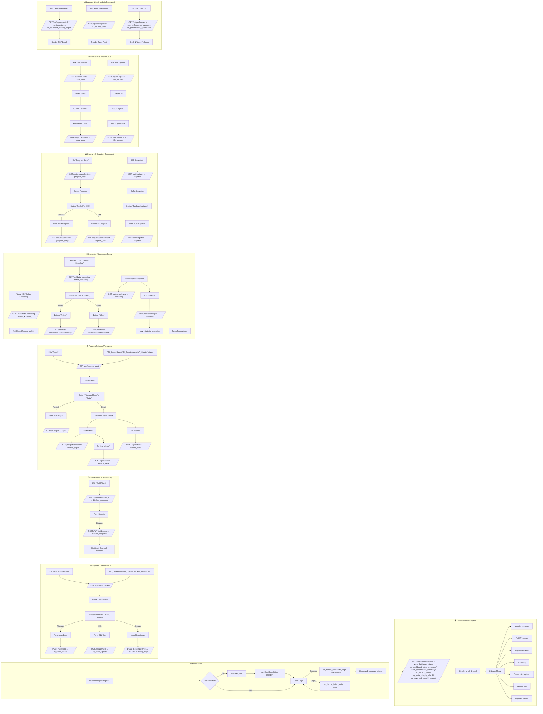

```mermaid
flowchart LR
    %% ================= AUTHENTICATION & NAVIGATION =================
    subgraph Auth [🔐 Authentication]
      direction TB
      A1[Halaman Login/Register]
      A2{User terdaftar?}
      A3[Form Register]
      A4[Form Login]
      A5["Verifikasi Email (jika register)"]
      A6[sp_handle_successful_login → buat session]
      A7[sp_handle_failed_login → error]
      A1 --> A2
      A2 -- No --> A3 --> A5 --> A4
      A2 -- Yes --> A4
      A4 -- Success --> A6 --> Dashboard
      A4 -- Gagal   --> A7 --> A4
    end

    %% ================= DASHBOARD & NAV BAR =================
    subgraph UI [🏠 Dashboard & Navigation]
      direction TB
      Dashboard[Halaman Dashboard Utama]
      API_Stats[/GET /api/dashboard-stats → view_dashboard_stats/ sp_dashboard_stats_enhanced/ view_performance_summary/ sp_security_audit/ sp_data_integrity_check/ sp_advanced_monthly_report/ .../]
      Dashboard --> API_Stats --> Render_Stats[Render grafik & tabel]
      Render_Stats --> Menu[Sidebar/Menu]
      Menu --> M_User[Manajemen User]
      Menu --> M_Pengurus[Profil Pengurus]
      Menu --> M_Rapat[Rapat & Absensi]
      Menu --> M_Konseling[Konseling]
      Menu --> M_Program[Program & Kegiatan]
      Menu --> M_Tamu[Tamu & File]
      Menu --> M_Laporan[Laporan & Audit]
    end

    %% ================= MODULE: MANAGE USERS =================
    subgraph User ["👥 Manajemen User (Admin)"]
      direction TB
      U1[Klik “User Management”]
      U2["Daftar User (tabel)"]
      U3[Button “Tambah” / “Edit” / “Hapus”]
      U1 --> API_ListUsers[/GET /api/users → users/]
      API_ListUsers --> U2
      U2 --> U3
      U3 -->|Tambah| FormUserTambah[Form User Baru]
      U3 -->|Edit| FormUserEdit[Form Edit User]
      U3 -->|Hapus| ConfirmDelete[Modal Konfirmasi]
      FormUserTambah --> API_CreateUser[/POST /api/users → tr_users_insert/]
      FormUserEdit   --> API_UpdateUser[/PUT /api/users/:id → tr_users_update/]
      ConfirmDelete  --> API_DeleteUser[/DELETE /api/users/:id → DELETE & activity_logs/]
      API_CreateUser/API_UpdateUser/API_DeleteUser --> API_ListUsers
    end

    %% ================= MODULE: PROFIL PENGURUS =================
    subgraph Pengurus ["🗂️ Profil Pengurus (Pengurus)"]
      direction TB
      P1[Klik “Profil Saya”]
      P2[Form Biodata]
      P1 --> API_GetBio[/GET /api/biodata/:user_id → biodata_pengurus/]
      API_GetBio --> P2
      P2 -->|Simpan| API_SaveBio[/POST/PUT /api/biodata → biodata_pengurus/]
      API_SaveBio --> AlertSuccess["Notifikasi: Berhasil disimpan"]
    end

    %% ================= MODULE: RAPAT =================
    subgraph Rapat ["📋 Rapat & Notulen (Pengurus)"]
      direction TB
      R1[Klik “Rapat”]
      R2[Daftar Rapat]
      R3[Button “Tambah Rapat” / “Detail”]
      R1 --> API_ListRapat[/GET /api/rapat → rapat/]
      API_ListRapat --> R2
      R2 --> R3
      R3 -->|Tambah| FormRapat[Form Buat Rapat]
      R3 -->|Detail| DetailRapat[Halaman Detail Rapat]
      FormRapat --> API_CreateRapat[/POST /api/rapat → rapat/]
      DetailRapat --> Absensi[Tab Absensi]
      Absensi --> API_ListAbsensi[/GET /api/rapat/:id/absensi → absensi_rapat/]
      Absensi --> ButtonTambahAbsen[Tombol “Absen”]
      ButtonTambahAbsen --> API_CreateAbsen[/POST /api/absensi → absensi_rapat/]
      DetailRapat --> Notulen[Tab Notulen]
      Notulen --> API_CreateNotulen[/POST /api/notulen → notulen_rapat/]
      API_CreateRapat/API_CreateAbsen/API_CreateNotulen --> API_ListRapat
    end

    %% ================= MODULE: KONSELING =================
    subgraph Konseling ["💬 Konseling (Konselor & Tamu)"]
      direction TB
      K1[Tamu: Klik “Daftar Konseling”]
      K2[Form Pendaftaran]
      K1 --> API_Daftar[/POST /api/daftar-konseling → daftar_konseling/]
      API_Daftar --> Alert_Tamu["Notifikasi: Request terkirim"]
      K3[Konselor: Klik “Jadwal Konseling”]
      K4[Daftar Request Konseling]
      K3 --> API_ListReq[/GET /api/daftar-konseling → daftar_konseling/]
      API_ListReq --> K4
      K4 -->|Terima| ActionTerima[Button “Terima”]
      K4 -->|Tolak| ActionTolak[Button “Tolak”]
      ActionTerima --> API_UpdateReq[/PUT /api/daftar-konseling/:id/status=disetujui/]
      ActionTolak  --> API_UpdateReqTolak[/PUT /api/daftar-konseling/:id/status=ditolak/]
      K5[Konseling Berlangsung]
      K5 --> API_GetSession[/GET /api/konseling/:id → konseling/]
      K5 --> FormKonseling[Form Isi Hasil]
      FormKonseling --> API_SaveKonseling[/PUT /api/konseling/:id → konseling/]
      API_SaveKonseling --> view_statistik_konseling
    end

    %% ================= MODULE: PROGRAM & KEGIATAN =================
    subgraph Program ["📊 Program & Kegiatan (Pengurus)"]
      direction TB
      G1[Klik “Program Kerja”]
      G2[Daftar Program]
      G3[Button “Tambah” / “Edit”]
      G1 --> API_ListProg[/GET /api/program-kerja → program_kerja/]
      API_ListProg --> G2
      G2 --> G3
      G3 -->|Tambah| FormProg[Form Buat Program]
      G3 -->|Edit| FormProgEdit[Form Edit Program]
      FormProg --> API_CreateProg[/POST /api/program-kerja → program_kerja/]
      FormProgEdit --> API_UpdateProg[/PUT /api/program-kerja/:id → program_kerja/]
      G4[Klik “Kegiatan”]
      G5[Daftar Kegiatan]
      G4 --> API_ListKeg[/GET /api/kegiatan → kegiatan/]
      API_ListKeg --> G5
      G5 --> ButtonTambahKeg[Button “Tambah Kegiatan”]
      ButtonTambahKeg --> FormKeg[Form Buat Kegiatan]
      FormKeg --> API_CreateKeg[/POST /api/kegiatan → kegiatan/]
    end

    %% ================= MODULE: TAMU & FILE =================
    subgraph FileTamu [📁 Buku Tamu & File Uploads]
      direction TB
      T1[Klik “Buku Tamu”]
      T2[Daftar Tamu]
      T1 --> API_ListTamu[/GET /api/buku-tamu → buku_tamu/]
      API_ListTamu --> T2
      T2 --> ButtonTambahTamu[Tombol “Tambah”]
      ButtonTambahTamu --> FormTamu[Form Buku Tamu]
      FormTamu --> API_CreateTamu[/POST /api/buku-tamu → buku_tamu/]
      F1[Klik “File Upload”]
      F2[Daftar File]
      F1 --> API_ListFile[/GET /api/file-uploads → file_uploads/]
      API_ListFile --> F2
      F2 --> ButtonUpload[Button “Upload”]
      ButtonUpload --> FormFile[Form Upload File]
      FormFile --> API_CreateFile[/POST /api/file-uploads → file_uploads/]
    end

    %% ================= MODULE: LAPORAN & AUDIT =================
    subgraph Laporan ["📈 Laporan & Audit (Admin/Pengurus)"]
      direction TB
      L1[Klik “Laporan Bulanan”]
      L1 --> API_LapBulanan[/GET /api/report/monthly?year=&month= → sp_advanced_monthly_report/]
      L2[Render PDF/Excel]
      API_LapBulanan --> L2
      L3[Klik “Audit Keamanan”]
      L3 --> API_Audit[/GET /api/security-audit → sp_security_audit/]
      L4[Render Tabel Audit]
      API_Audit --> L4
      L5[Klik “Performa DB”]
      L5 --> API_Perf[/GET /api/performance → view_performance_summary/ sp_performance_optimization/]
      API_Perf --> L6[Grafik & Tabel Performa]
    end
```
